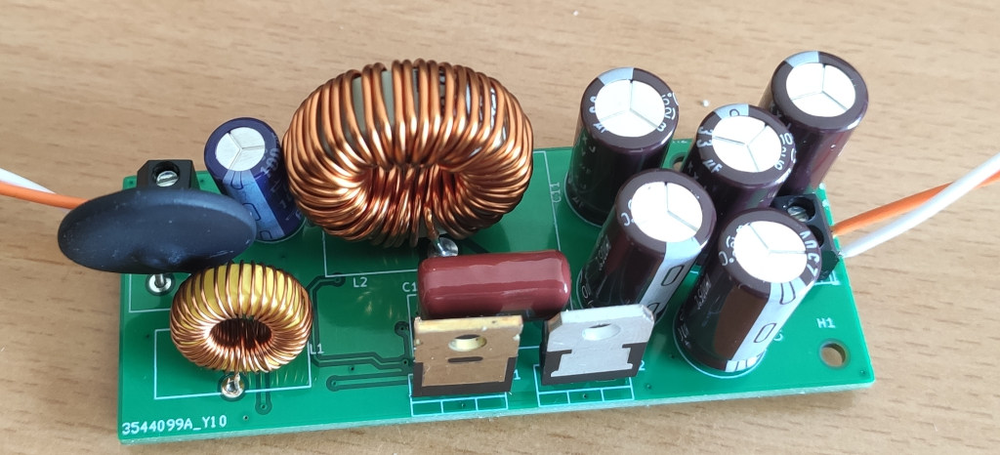
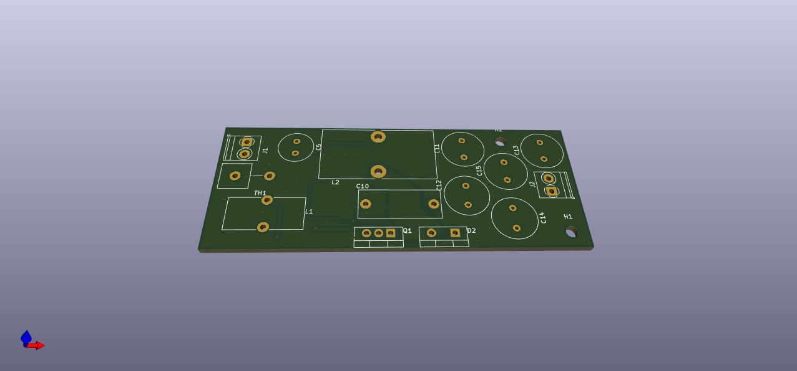
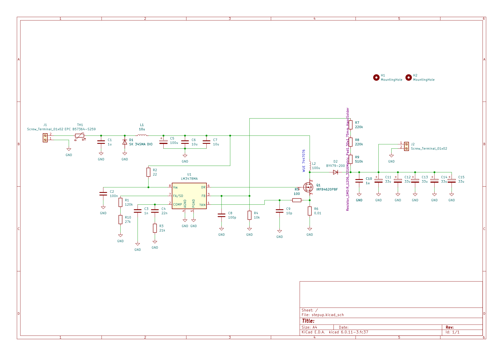

# Non-isolated 12V to 120V boost converter

This project is about finding a power supply to drive regular 240V/120V
LED bulbs from a 12V power supply or 12V battery.

This is the first prototype build using the [LM3478](https://www.ti.com/product/de-de/LM3478).

It features:
- Up to 36 Watts
- Inrush current limit
- LC input filter
- Follows TI's reference design

## Analysis

The boost converter was found working and it outputs 120VDC.

**WARNING**: The project was abadonned due to the undocumented behaviour of the LM3478!

- The LM3478 has no soft-start mechanism.
- The LM3478 starts to operate at 3V at Vin
- The LM3478 gate drive voltage is quite low with 7.2V or less

**At startup the LM3478 doesn't operate at all. It just pulls the gate drive high and
waits for an over-current condition. Once the over-current conditions happens it
starts operating in PWM mode.**

**The board draws more than 40Watts without starting to switch the Mosfet as the current
limit isn't reached.**

## kicad board files

The PCB has dimensions of 32mmx82mm:

The schematic [available as PDF here](schematics.pdf) is following the reference design:

## Disclaimer

    THE OPEN SOURCE SOFTWARE/HARDWARE IN THIS PROJECT IS DISTRIBUTED
    IN THE HOPE THAT IT WILL BE USEFUL, BUT WITHOUT ANY WARRANTY, WITHOUT
    EVEN THE IMPLIED WARRANTY OF MERCHANTABILITY OR FITNESS FOR A
    PARTICULAR PURPOSE.
